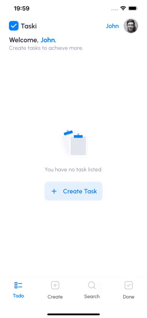
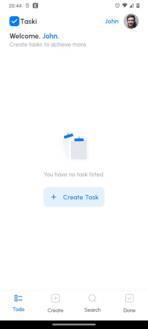

# Desafio de Código - Mobile - Taski


Este projeto foi desenvolvido utilizando **Dart** e **Flutter**. Siga as instruções abaixo para rodá-lo localmente.

<p align="center">
  
  
</p>

## 📋 Pré-requisitos

- **Flutter**: Certifique-se de ter o [Flutter](https://flutter.dev/docs/get-started/install) instalado em seu sistema.
- **Dependências**: Instale as dependências necessárias executando o comando:
  ```bash
  flutter pub get
  ```

## ⚙️ Rodando o Projeto

1. Clonando o Repositório

Clone este repositório para o seu ambiente local:

git clone https://github.com/alexomantovani/taski-to-do.git
cd CAMINHO-SEU-REPOSITORIO/taski-to-do

2. Rodando no VSCode

- Abra o VSCode.
- Instale a extensão do Flutter (se ainda não a tiver instalada) na loja de extensões do VSCode.
- Abra a pasta do projeto no VSCode:
- code .
- Selecione o dispositivo de emulação ou um dispositivo físico conectado.
- Execute o aplicativo com o atalho F5 ou clicando em Run no menu.

3. Rodando no Android Studio

- Abra o Android Studio.
- Instale a extensão do Flutter (se ainda não a tiver instalada) em Preferences > Plugins > Marketplace e procure por Flutter.
- Abra a pasta do projeto no Android Studio.
- Selecione o dispositivo de emulação ou um dispositivo físico conectado.
- Execute o aplicativo clicando em Run ou pressionando Shift + F10.

4. Rodando no Xcode (para iOS)

- Abra o terminal e navegue até o diretório do projeto:
- cd CAMINHO-SEU-REPOSITORIO/taski-to-do
- Execute o comando para limpar o projeto:
- flutter clean
- Abra o projeto no Xcode:
- open ios/Runner.xcworkspace
- No Xcode, selecione o dispositivo de emulação ou um dispositivo físico conectado.
- Clique no botão Run (triângulo verde) ou use o atalho Cmd + R para rodar o aplicativo.

5. Rodando no IntelliJ IDEA

- Abra o IntelliJ IDEA.
- Instale a extensão do Flutter (se ainda não a tiver instalada) em Preferences > Plugins > Marketplace e procure por Flutter.
- Abra a pasta do projeto no IntelliJ IDEA.
- Selecione o dispositivo de emulação ou um dispositivo físico conectado.
- Execute o aplicativo com o atalho Shift + F10 ou clicando em Run no menu.

## 🗄️ Banco de Dados

Este projeto utiliza um banco de dados local Hive. Certifique-se de que o dispositivo ou emulador tenha permissões para acessar o armazenamento local.

## 🧪 Testes Automatizados

1.  Se desejar rodar os testes automatizados, vá até o arquivo do teste que deseja executar:
    ctrl + F5 ou aperte o botão Run
